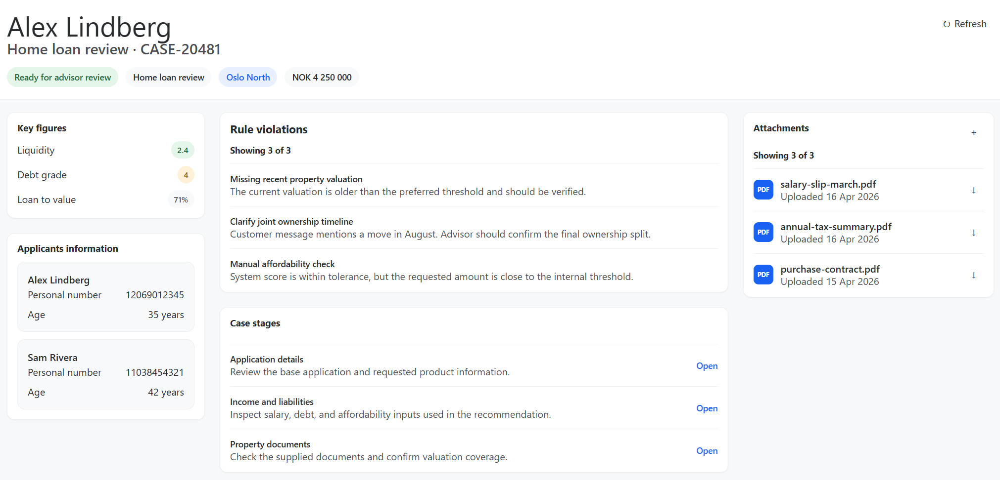

# Leo Advisor Interview Starter

## Start

```bash
npm install
npm start
```

The app runs on `http://localhost:4200` by default.

## Task

You are working on a sanitized Angular starter that represents part of an advisor workflow.

The page already shows case metadata, rule violations, case stages, and attachments. Applicant information is intentionally missing.

Create an `ApplicantInformationComponent` and render it on the existing advisor overview page where you think it belongs.

Use the sketch below as a visual guide.



## Requirements

1. Render one card or row per participant.
2. Show the participant's full name.
3. Show the participant's personal number.
4. Derive age from the participant's personal number.
5. Wire the component into the existing page.

## Parsing Rule

- You can assume the first 6 digits of the personal number represent `ddMMyy`.

## Notes

- Keep the scope tight. You do not need routing, services, HTTP calls, or state libraries.
- Treat the sketch as directional rather than pixel perfect.
- Existing participant data is already available in `src/app/mock-data/advisor-case.mock.ts`.
- A shared panel component already exists in `src/app/shared/ui/panel/`.
- If you get stuck on parsing, you may use the helper functions in `src/app/core/utils/personal-number.ts`.
